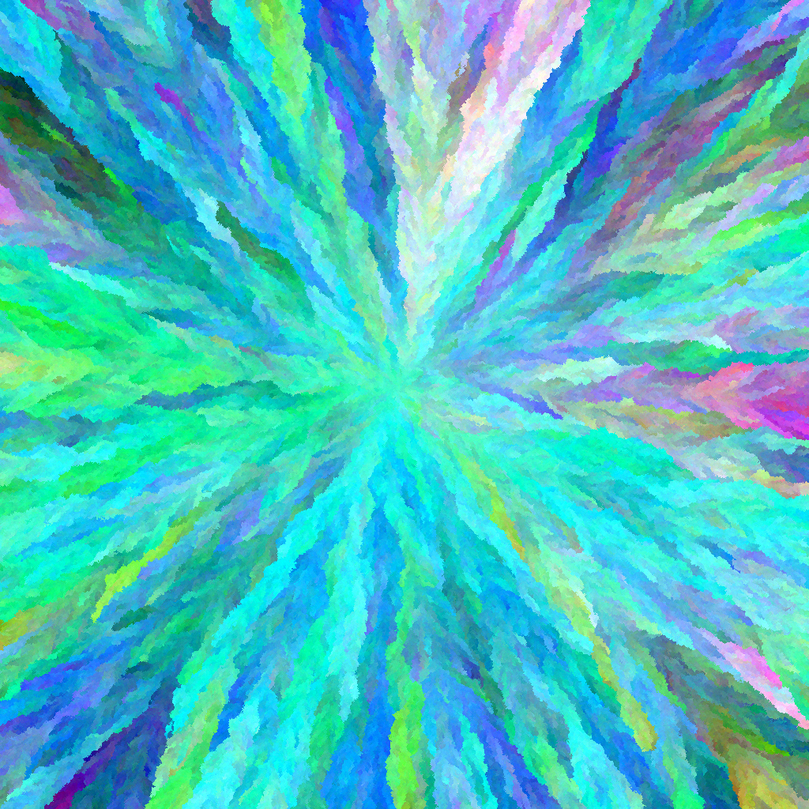
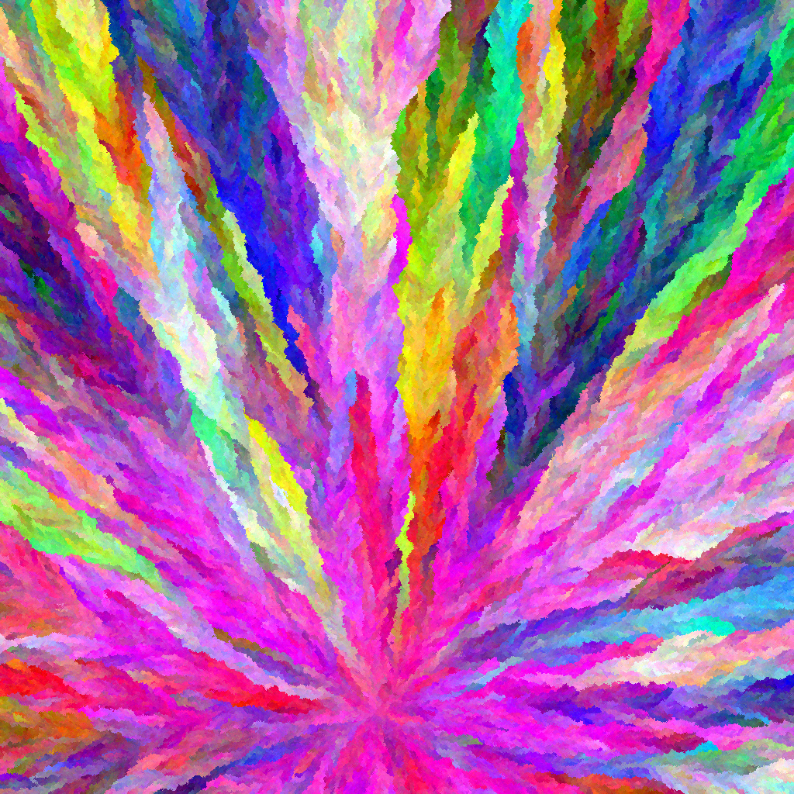
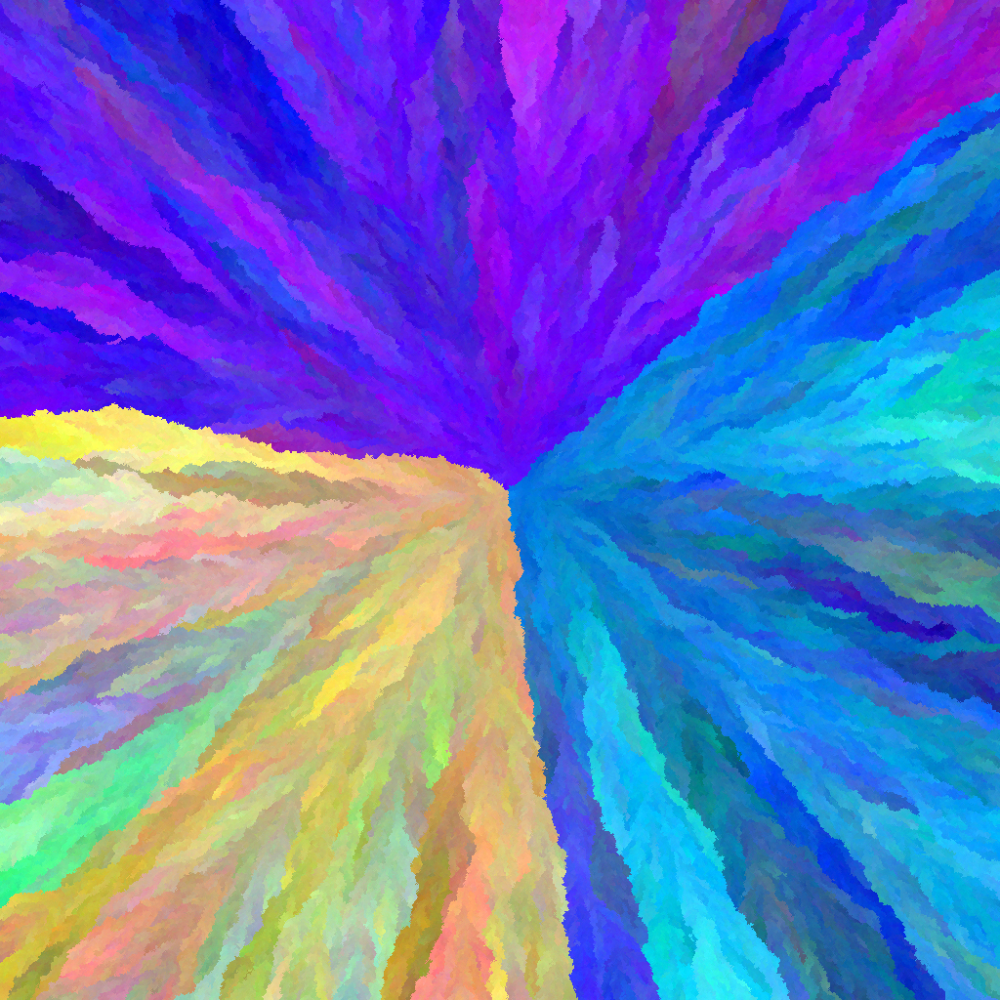
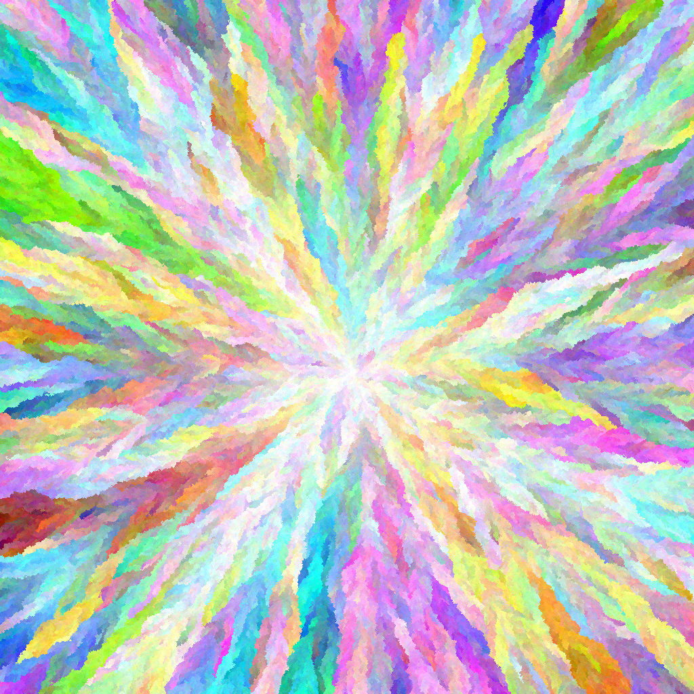

# Artificial life playground

This is a reproduction of the demo presented by Dave Ackley in his presentation:

")

## Goals
* ✅ Discover the zig programming language
* ✅ Implement a more performant version of Dave Ackley's demo

## TODO
* ✅ Efficient sprite renderer (1M+ at 144+Hz)
* ✅ Dear ImGui integration
* ✅ Camera controls
* ✅ "Lifeform" logic
* ✅ Export to image
* Mutating herbivore logic

## Results

Video demonstrating plants, zaps and herbivores:

After implementing mutating plants I discovered I accidently made some kind of art generator, here are some results:

